# 任务2-小试牛刀

## 作业1：ERC20代币

### 合约源码
contracts/MyERC20Token.sol

### 已部署到sepolia测试，交易查看
https://sepolia.etherscan.io/tx/0x46943da73883a2f06d9701d770546f1b427579e26c1d76bd3927924077f673c6

### token合约地址
0xB3630080d7a5851A1A7dE2B6D0d9c95e0B7A4D84

### 铸币交易
https://sepolia.etherscan.io/tx/0x8abafe38fce11c78105b3ae334b229040e3b973d3713da797f013e8a85351e53

### 导入到自己的钱包
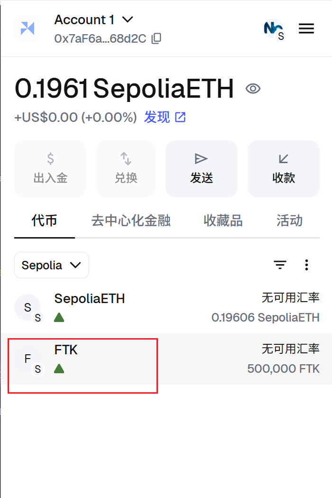

## 作业2：在测试网上发行一个图文并茂的 NFT

### 合约源码
contracts\PetNFT.sol

### 合约地址
0x56A3615569bAe929B63F485A7d5A1681F92bC025

### NFT铸造交易
https://sepolia.etherscan.io/tx/0x27503500b18e8b8f7c3348bb8d952cdd018b2c190ce995f31671ca35fbbc7999

### NFT地址
https://sepolia.etherscan.io/token/0x56a3615569bae929b63f485a7d5a1681f92bc025

### MetaMask查看NFT
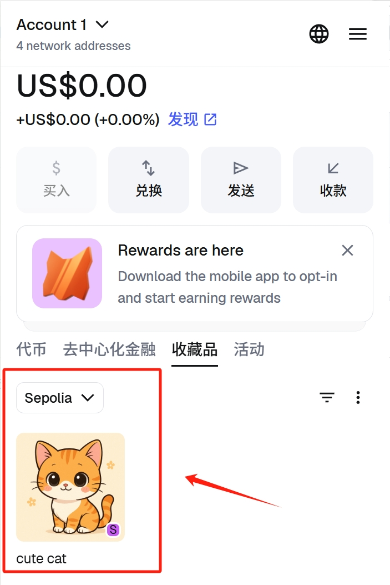
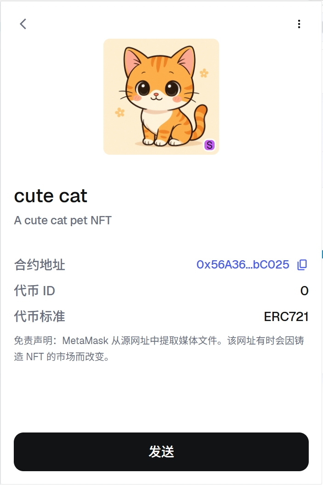

## 作业3：编写一个讨饭合约

### 合约源码
contracts\BeggingContract.sol

### 合约地址
0xAD128c842dAC68D89973a1Da3f0c32Fa56b98164

### 合约创建交易
https://sepolia.etherscan.io/tx/0xb6f68eb8a312c69fa41c93becd07daaa8ec81a44d0fe30deb56f63d764df67fc

### 测试账号    
账号1：0x7af6ae9c047d0078b009c03c32a60974c1868d2c（合约拥有者）（捐赠9999）      
账号2：0x81fbae1e7980b88f1690eda49b48992573c0589e（捐赠299999）     
账号3：0x10a6e4f1d8fe43b22432a3f9539d38c24e78925f（捐赠150000）     
账号4：0xf38e55d6f05178480e55ceabea68b331a3063f70（捐赠550000）

### donate函数测试
* 调用记录：    
账号1：
https://sepolia.etherscan.io/tx/0x1cde60cabb1f407611967989e220203bfbf7bd7c59d50ec22bc50f815e1470ab
账号2：
https://sepolia.etherscan.io/tx/0x0f4fd35bd9bfb18322c21b5a661be9c66dd26f5d1913b83d69a323bb411440b1
账号3：
https://sepolia.etherscan.io/tx/0xc3b15360e49b5aad9e8473d631a4cebfd7e9880fda8d5ff6bd353570f6b1d646
账号4：
https://sepolia.etherscan.io/tx/0x9bf013c23cf665c2c25051edf97b198d6932eb95a99c234737df0563d7f43f79

* 调用成功截图： 
账号1：
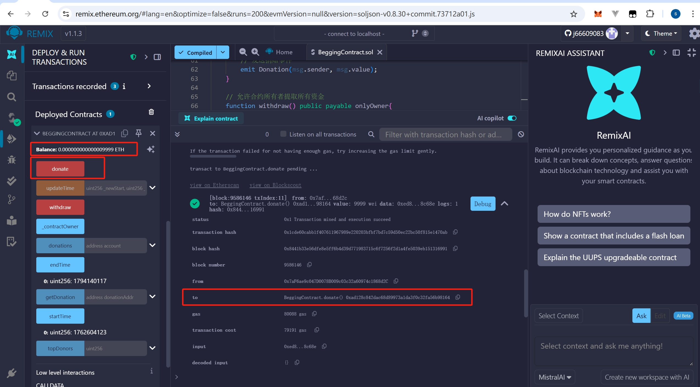
账号2：
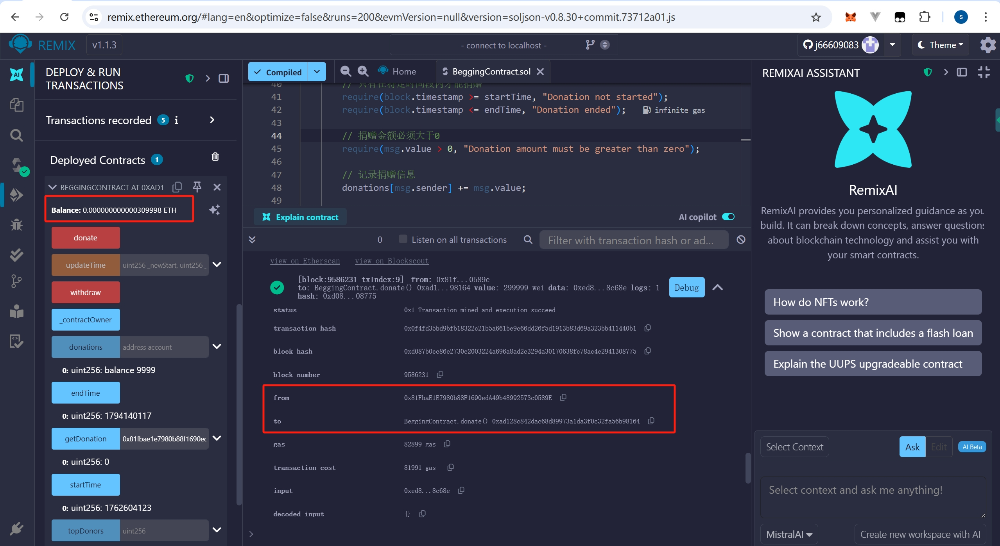
账号3：
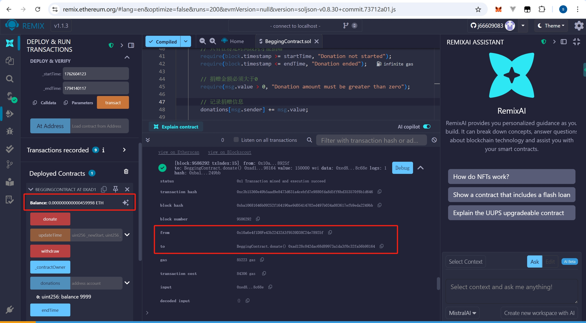
账号4：
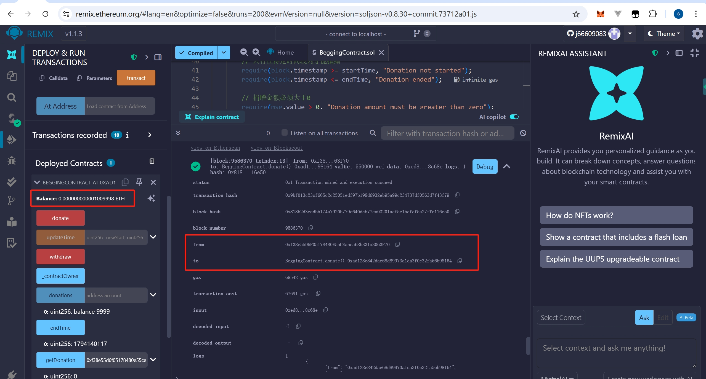

* 捐赠0的异常场景测试：
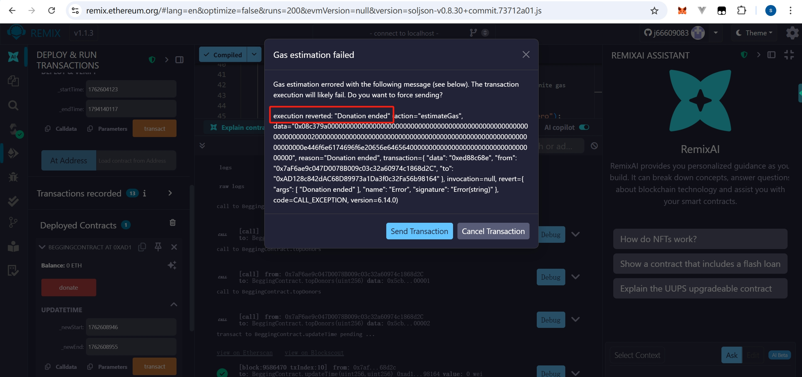

* 时间限制测试：
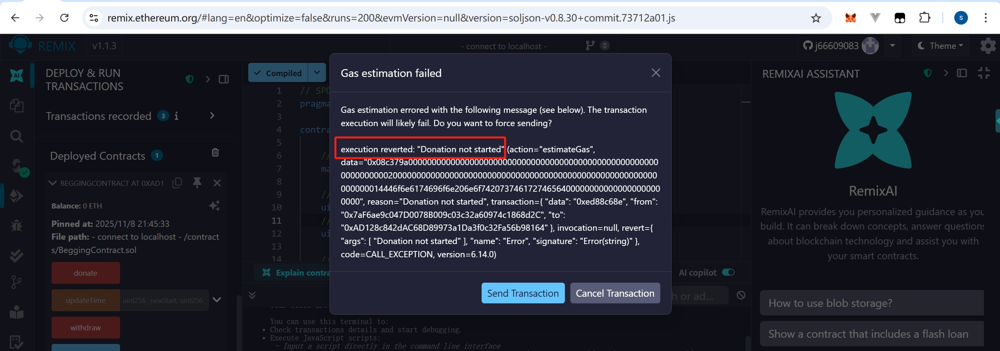

### getDonation函数测试
* 调用成功截图：
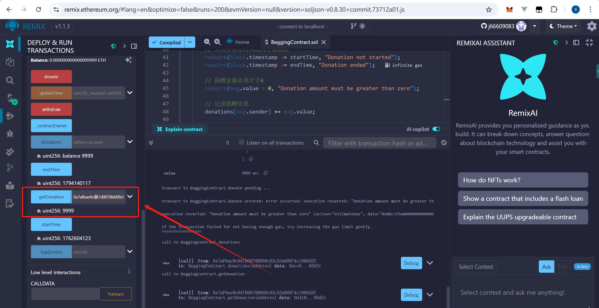

### withdraw函数测试
* 调用成功记录：
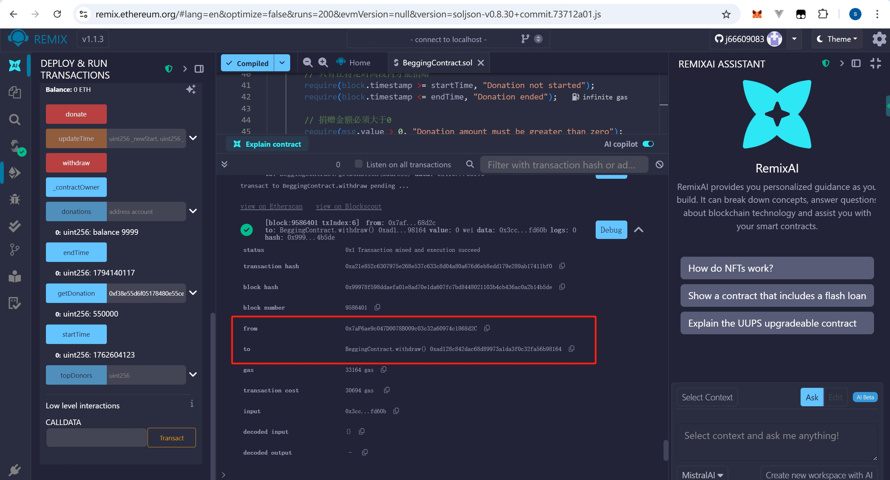
https://sepolia.etherscan.io/tx/0xa21e852c6307975e268e537c633c8d04a80a676d6eb8edd179e289ab17411bf0

### 捐赠事件测试
查看地址：https://sepolia.etherscan.io/address/0xad128c842dac68d89973a1da3f0c32fa56b98164#events

### 捐赠排行榜测试
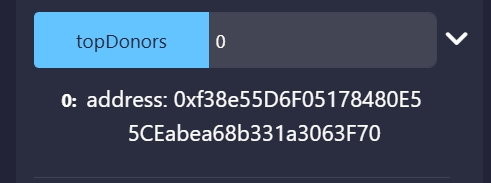

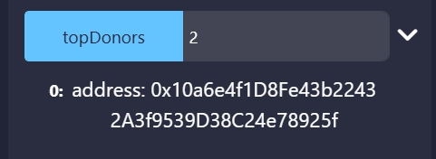